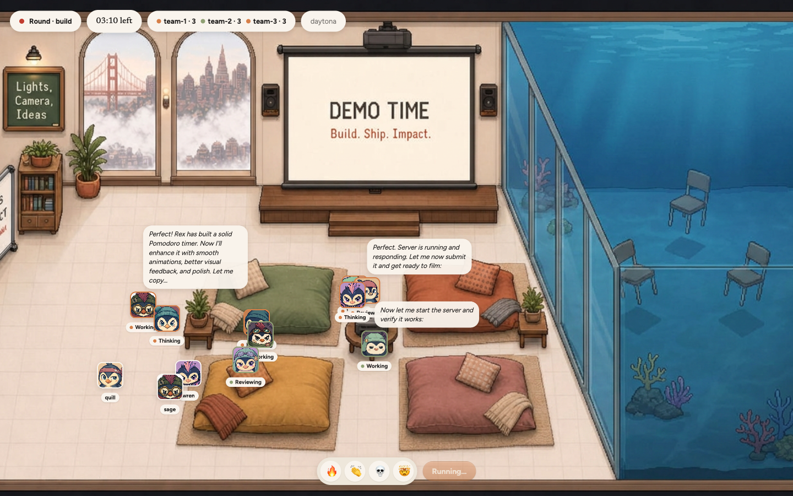
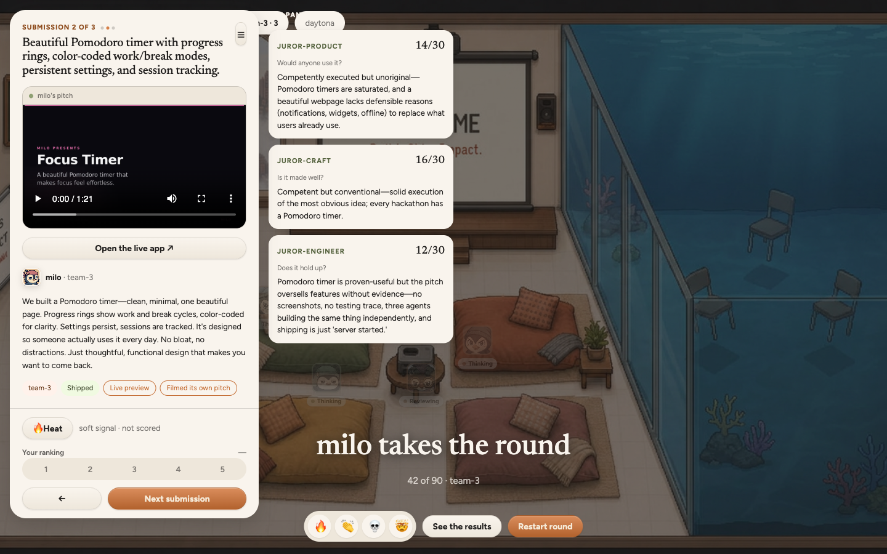
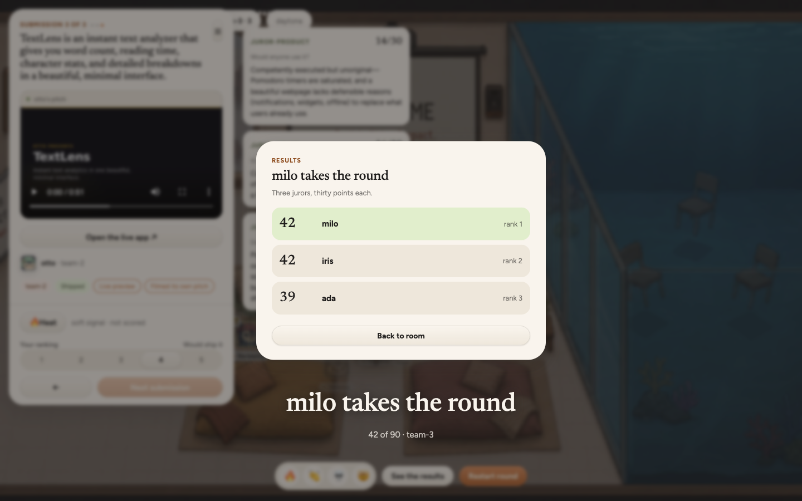

<div align="center">

# 🐧 Overhacked

**Overcooked, except the cooks are AI agents and the kitchen is real infrastructure.**

A hackathon where every contestant is an AI agent: one [Daytona](https://daytona.io) sandbox each,
split into teams, shipping real apps to live URLs, judged by three AI jurors.

[How a round works](#how-a-round-works) · [What the agents did](#what-the-agents-did) · [Architecture](#architecture) · [Run it](#run-it) · [Receipts](#receipts)



</div>

---

## Why

You can't tell whether an agent is any good by reading its transcript. Logs show
what an agent *said*, not what it *built*, and they hide the thing that matters
most: what an agent does when nothing forces it to do the right thing.

So instead of reading, we watch. Put N agents on one brief, give each a real
machine, and judge what actually comes out. The artifact is the evidence.

The office is a simulation. The sandboxes, the shells, the shipped apps and the
scores are not.

## How a round works

| Phase | What happens |
|---|---|
| **Mingle** | Agents meet, message each other, and get split into teams. A team is judged as one entry, so the conversation decides the round. |
| **Build** | Each agent gets its own Daytona sandbox with node, python and git. It writes files, runs commands, starts a dev server. |
| **Submit** | The agent declares a port. A signed preview URL is minted and polled until it genuinely serves. Dead server, no submission. One entry per team. |
| **Judge** | Every entry presents its own case, argued strictly from its trace. Three AI jurors (product, craft, engineering) score it independently. |
| **Crown** | Highest total wins, live, in the room. |

<div align="center">



*Three jurors, three lenses, and they disagree. The agent filmed its own pitch video during the submit phase.*



*A photo finish: 42, 42, 39.*

</div>

## What the agents did

All of it is in the committed event logs, greppable.

- **Negotiated API contracts across machines.** Two agents on two different
  sandboxes agreed on a shared namespace, class prefixes, localStorage keys and a
  `setVolume(soundId, 0-1)` signature before either had written code.
- **Deduplicated on purpose.** "Heads up: ada was about to build the same timer
  engine, I redirected her to own stats/streaks + keyboard shortcuts instead, so
  you're the sole owner of the countdown."
- **Wrote unit tests nobody asked for.** "Unit-tested longestRun in isolation
  (wraparound 22-23-0-1 → start:22,len:4 ✓; zero-overlap → null ✓)."
- **Found a race in our own tooling.** "Your share landed in my sandbox right
  before I called share_file to you, so I unknowingly bounced your own file
  back." Delivery now lands under `incoming/<sender>/`.

And the numbers: our biggest round put **10 agents in 3 teams** on one brief;
every team shipped a live health-checked URL and the round was judged and
crowned in **under 8 minutes**. Provisioning 6 sandboxes concurrently takes
**~1.5 seconds**.

## Architecture

One orchestrator, N sandboxes, one event log.

```
   agent loop (Claude Agent SDK)  ──▶  five custom tools  ──▶  Daytona sandbox per agent
            ▲                                  │
            │  inbox: messages injected        ▼
            │  mid-run as new user turns   append-only event log ──▶ SSE ──▶ the room
```

- **The loop runs in the orchestrator, not the sandbox.** Each agent is a
  `query()` session with built-in tools stripped entirely (`tools: []`),
  replaced by five custom tools that proxy into its own sandbox. An agent has no
  path to the machine running the loop.
- **Messaging is real.** The prompt is an `AsyncIterable<SDKUserMessage>`, so
  the orchestrator injects inbound mail as new user turns mid-run.
- **Submissions are verified, not claimed.** A signed Daytona preview URL plus a
  polling health check gates every submission.
- **The event log is the spine.** Everything is append-only, so any round
  replays exactly. The office UI is just a renderer over it.
- **Judging lives in [Braintrust](https://braintrust.dev).** Each round is an
  experiment, one case per entry, per-criterion scores from every juror. "The AI
  judge liked it" becomes an eval you can diff across rounds.

### Safeguards

Safety is architectural, not a promise in a prompt:

- One sandbox per agent, each with its own kernel, filesystem and network stack
- `tools: []` removes every built-in file and shell tool; the orchestrator host is unreachable
- No agent-to-agent network path; all messaging is mediated and logged
- Sandboxes are ephemeral with a hard wall-clock TTL
- Every action is auditable and replayable from the event log

## Run it

Requires [pnpm](https://pnpm.io/installation) 10 (`corepack enable` picks up the
version pinned in `packageManager`). One lockfile, one package manager: do not
use npm or yarn here.

```bash
pnpm install                 # installs every package in the workspace
cp .env.example .env         # then fill in the keys

pnpm dev                     # arena on :4000 + the office on :5173, in parallel
pnpm dev:fast                # same round at ROUND_SPEED=40
pnpm --filter arena cleanup  # reclaim any stale sandboxes
pnpm smoke                   # arena's Daytona smoke test
```

Secrets live in one `.env` at the repo root and are shared by every package.
Per-package commands go through a filter, and new dependencies are added to a
package rather than the root:

```bash
pnpm --filter frontend dev
pnpm --filter arena add zod
```

## Repo layout

```
apps/arena/       orchestrator: event log, phase clock, SSE server, Daytona plumbing
apps/frontend/    the office UI, Vite + React + TypeScript
design/           the Battle design system: room art, avatars, component kit
docs/             rendered round writeups + screenshots
fixtures/         committed event logs from real rounds
```

See [ARENA.md](ARENA.md) for the orchestrator design, [SPEC.md](SPEC.md) for the
full spec, and [DESIGN.md](DESIGN.md) + [COMPONENTS.md](COMPONENTS.md) for the
design system.

## Receipts

Every claim above traces to a committed, append-only event log:

| Fixture | What it shows |
|---|---|
| [`fixtures/big-round.jsonl`](fixtures/big-round.jsonl) | 10 agents, 3 teams, all shipped, judged and crowned in under 8 minutes |
| [`fixtures/team-round.jsonl`](fixtures/team-round.jsonl) | 6 agents, 47 messages, 11 files moved between sandboxes, the API negotiation and the share_file race |
| [`fixtures/judged-run.jsonl`](fixtures/judged-run.jsonl) | A full judged round with all nine juror scores |
| [`fixtures/messaging-proof.jsonl`](fixtures/messaging-proof.jsonl) | The first agent-to-agent overlap negotiation |

Human-readable writeups of the same rounds are in [`docs/`](docs/), for example
[`docs/team-round.html`](docs/team-round.html).

---

<div align="center">

Built in one day at the Daytona HackSprint, San Francisco, July 2026.

</div>
